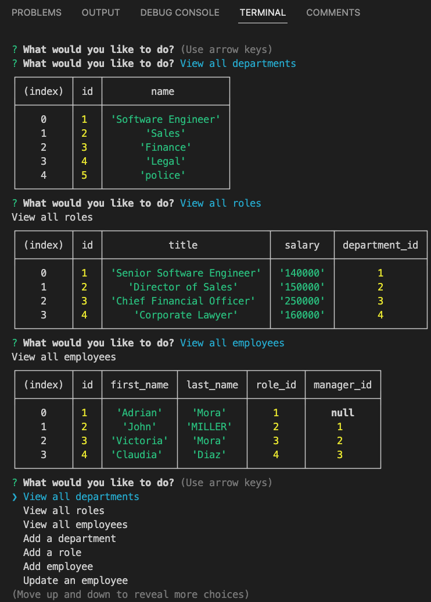

  

## Table of Contents

- [Overview](#overview)
- [Built With](#built-with)
- [Lisence](#lisence)
- [Features](#features)
- [Contact](#contact)
- [Acknowledgements](#acknowledgements)

## Overview
   **[Check the live video](https://drive.google.com/file/d/18Fbx6TZYY-1Hbz21vcP3caYAWEh-PtjB/view)**

### Built With

1.  JS-BLACK-logo.png"  width="25" height="20">   [nodeJS](https://nodejs.org/en/docs/)

2.     [Sequelize](https://sequelize.org/)

3.     [mySql](https://www.mysql.com/about/legal/logos.html)

4.      [JavaScript]()

## Lisence

Copyright © 2007 Free Software Foundation, Inc. <https://fsf.org/>

Everyone is permitted to copy and distribute verbatim copies of this license document, but changing it is not allowed.

## Features

    

With *Organilize*,

* You can view all departments, roles, employees by name and i.d.
* Easily add roles to employees as well as add new employees and departments.
* Update employess status by changing their roles and also departments if any change has happened.

## Contact

If you would like to contribute or have any questions , please contact me at:

 [Email](mailto:moraadrian510@icloud.com)

 [GitHub](https://github.com/moraadrian510)

## Acknowledgements

1. [askBCS LearningAssistant]()

2.   [StackOverflow](https://stackoverflow.com/)

3.   [YouTube](https://www.youtube.com)

--- 
 Thank You for your feedback!!
